# BookStore Microservices - Architecture Diagrams

## 📐 1. Tổng Quan Kiến Trúc Hệ Thống (System Architecture)

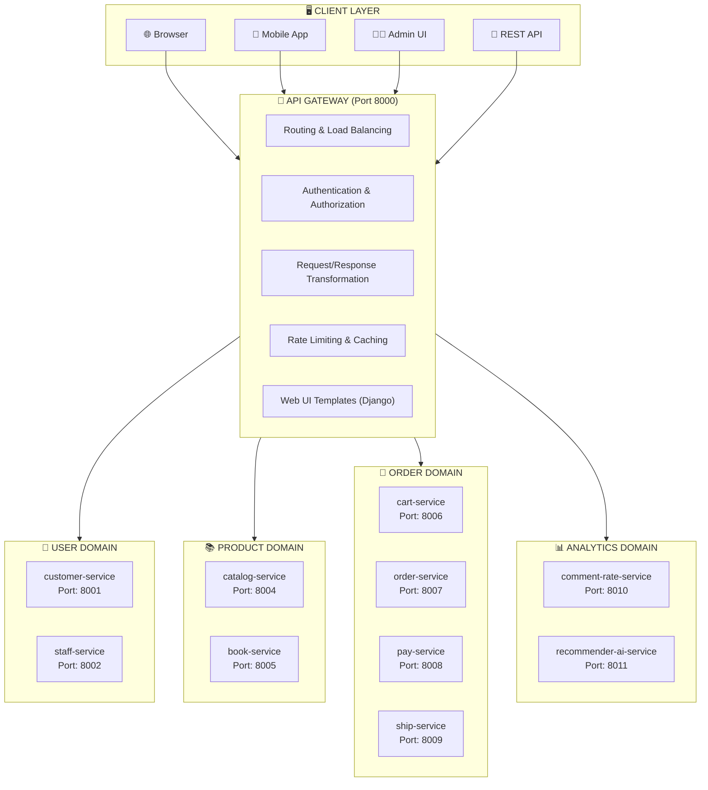

---

## 📐 2. Chi Tiết Kiến Trúc Từng Service

### 2.1 Customer Service (Port 8001)

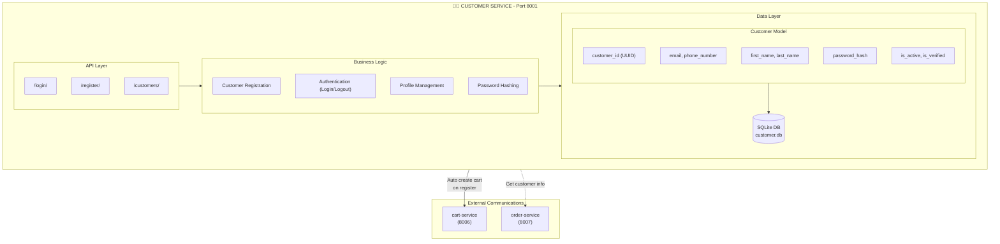

### 2.2 Staff Service (Port 8002)

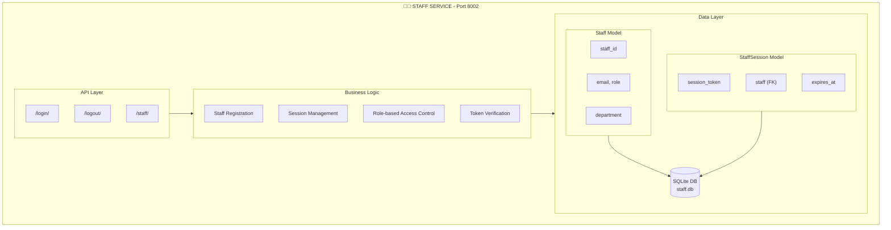

### 2.3 Catalog Service (Port 8004)

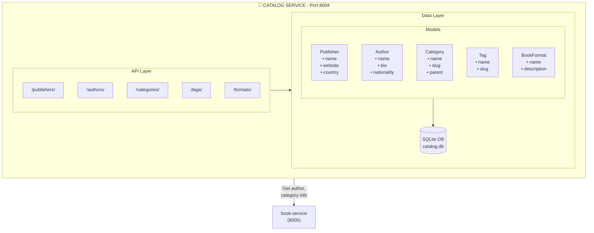

### 2.4 Book Service (Port 8005)

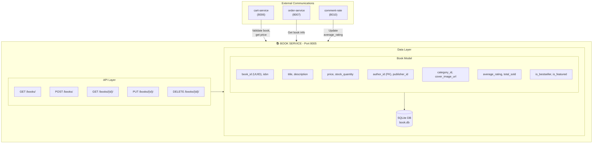

### 2.5 Cart Service (Port 8006)

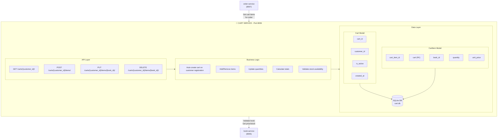

### 2.6 Order Service (Port 8007)

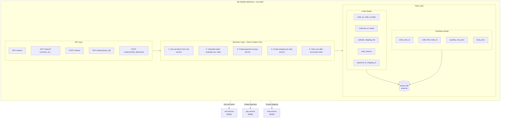

### 2.7 Pay Service (Port 8008)

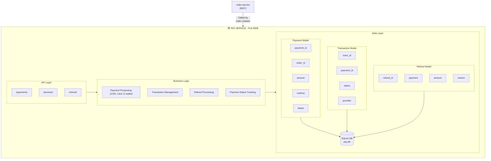

### 2.8 Ship Service (Port 8009)

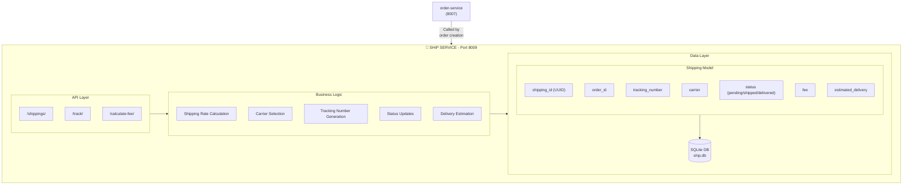

### 2.9 Comment-Rate Service (Port 8010)

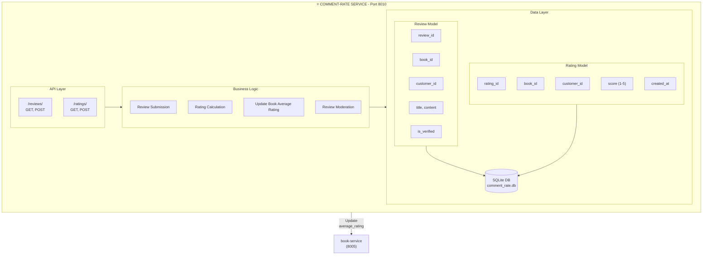

### 2.10 Recommender AI Service (Port 8011)

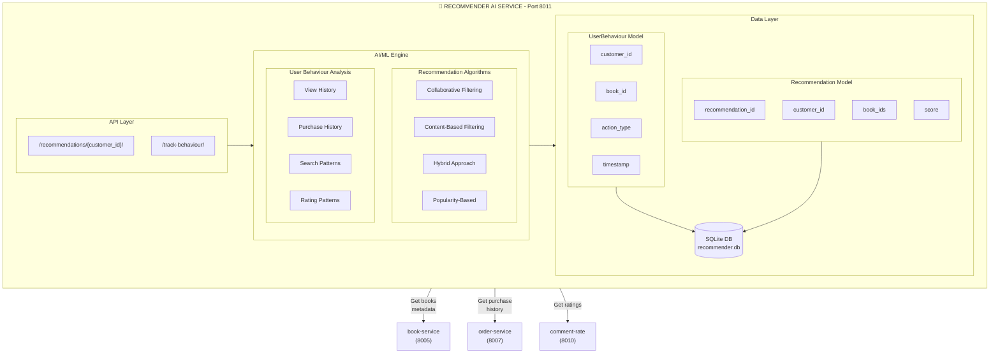

### 2.11 API Gateway (Port 8000)

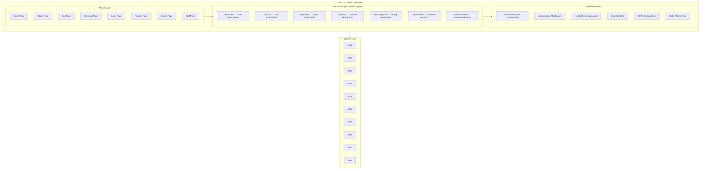

---

## 📐 3. Sơ Đồ Luồng Dữ Liệu (Data Flow Diagrams)

### 3.1 Customer Registration Flow

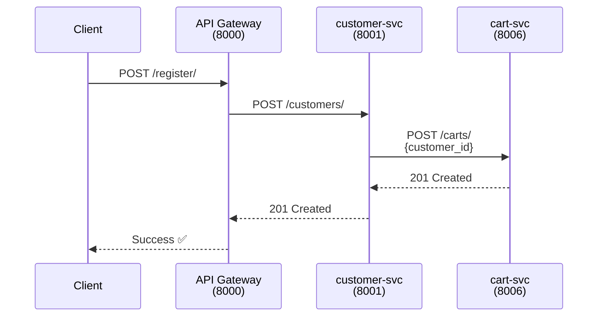

### 3.2 Add to Cart Flow

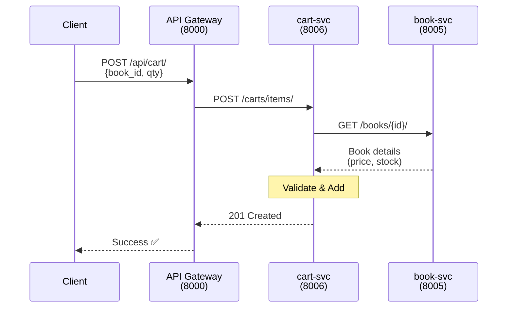

### 3.3 Order Creation Flow

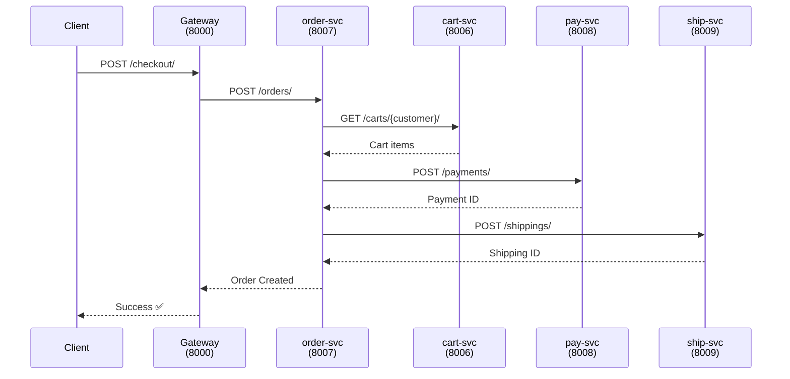

### 3.4 Review & Rating Flow

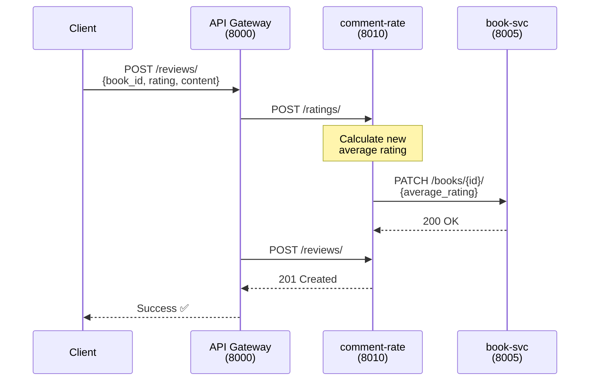

---

## 📐 4. Deployment Architecture (Docker)

```mermaid
flowchart TB
    subgraph DockerHost["🐳 DOCKER HOST"]
        subgraph Network["Docker Network: bookstore-network"]
            subgraph Row1[""]
                GW["api-gateway<br/>:8000<br/>📦 SQLite"]
                CS["customer-svc<br/>:8001<br/>📦 SQLite"]
                SS["staff-svc<br/>:8002<br/>📦 SQLite"]
                CAS["catalog-svc<br/>:8004<br/>📦 SQLite"]
            end
            subgraph Row2[""]
                BS["book-svc<br/>:8005<br/>📦 SQLite"]
                CRS["cart-svc<br/>:8006<br/>📦 SQLite"]
                OS["order-svc<br/>:8007<br/>📦 SQLite"]
                PS["pay-svc<br/>:8008<br/>📦 SQLite"]
            end
            subgraph Row3[""]
                SHS["ship-svc<br/>:8009<br/>📦 SQLite"]
                CMS["comment-rate<br/>:8010<br/>📦 SQLite"]
                RS["recommender<br/>:8011<br/>📦 SQLite"]
            end
        end
    end

    subgraph PortMapping["Port Mapping"]
        P8000["Host:8000 → api-gateway:8000"]
        P8001["Host:8001 → customer-service:8001"]
        P8002["Host:8002 → staff-service:8002"]
        P8004["Host:8004 → catalog-service:8004"]
        P8005["Host:8005 → book-service:8005"]
        P8006["Host:8006 → cart-service:8006"]
        P8007["Host:8007 → order-service:8007"]
        P8008["Host:8008 → pay-service:8008"]
        P8009["Host:8009 → ship-service:8009"]
        P8010["Host:8010 → comment-rate:8010"]
        P8011["Host:8011 → recommender:8011"]
    end
```

---

## 📐 5. Technology Stack Diagram

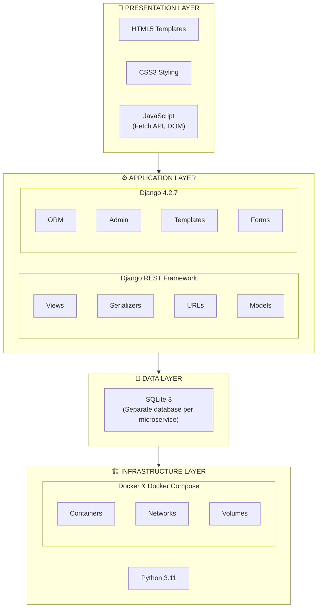

---

## 📊 6. Service Communication Matrix

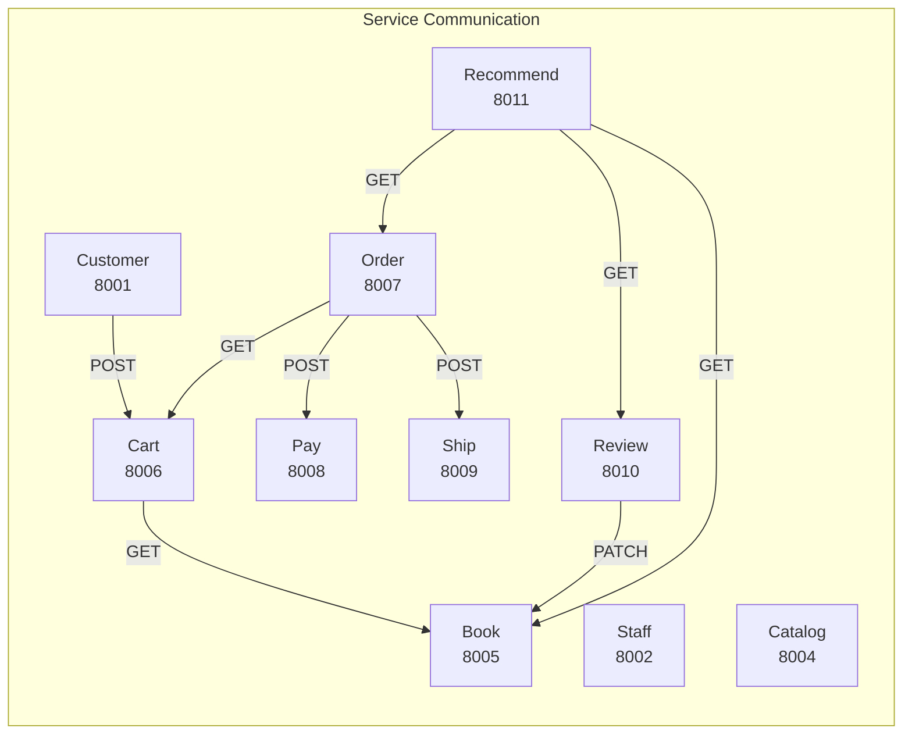

### Communication Table

| From \ To | Customer | Staff | Catalog | Book | Cart | Order | Pay | Ship | Review | Recommend |
|-----------|:--------:|:-----:|:-------:|:----:|:----:|:-----:|:---:|:----:|:------:|:---------:|
| **Customer** | - | - | - | - | POST | - | - | - | - | - |
| **Staff** | - | - | - | CRUD | - | GET | - | - | - | - |
| **Catalog** | - | - | - | - | - | - | - | - | - | - |
| **Book** | - | - | GET | - | - | - | - | - | - | - |
| **Cart** | - | - | - | GET | - | - | - | - | - | - |
| **Order** | - | - | - | - | GET | - | POST | POST | - | - |
| **Pay** | - | - | - | - | - | - | - | - | - | - |
| **Ship** | - | - | - | - | - | - | - | - | - | - |
| **Review** | - | - | - | PATCH | - | - | - | - | - | - |
| **Recommend** | - | - | - | GET | - | GET | - | - | GET | - |

---

## 📐 7. Domain-Driven Design Overview

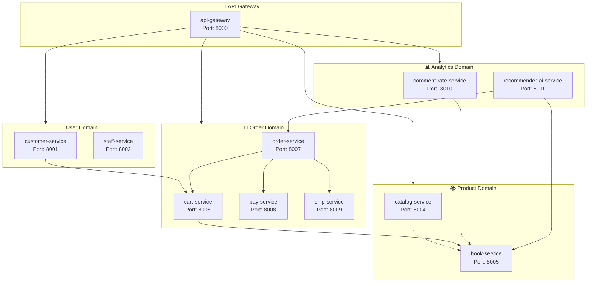

---

## 📝 Ghi chú

- ✅ Tất cả services sử dụng **REST API** để giao tiếp
- ✅ Mỗi service có **database riêng** (SQLite) đảm bảo tính độc lập
- ✅ **API Gateway** là điểm truy cập duy nhất cho clients
- ✅ Health check endpoint `/health/` được implement ở mỗi service
- ✅ Sử dụng **Docker Compose** để orchestrate tất cả services
